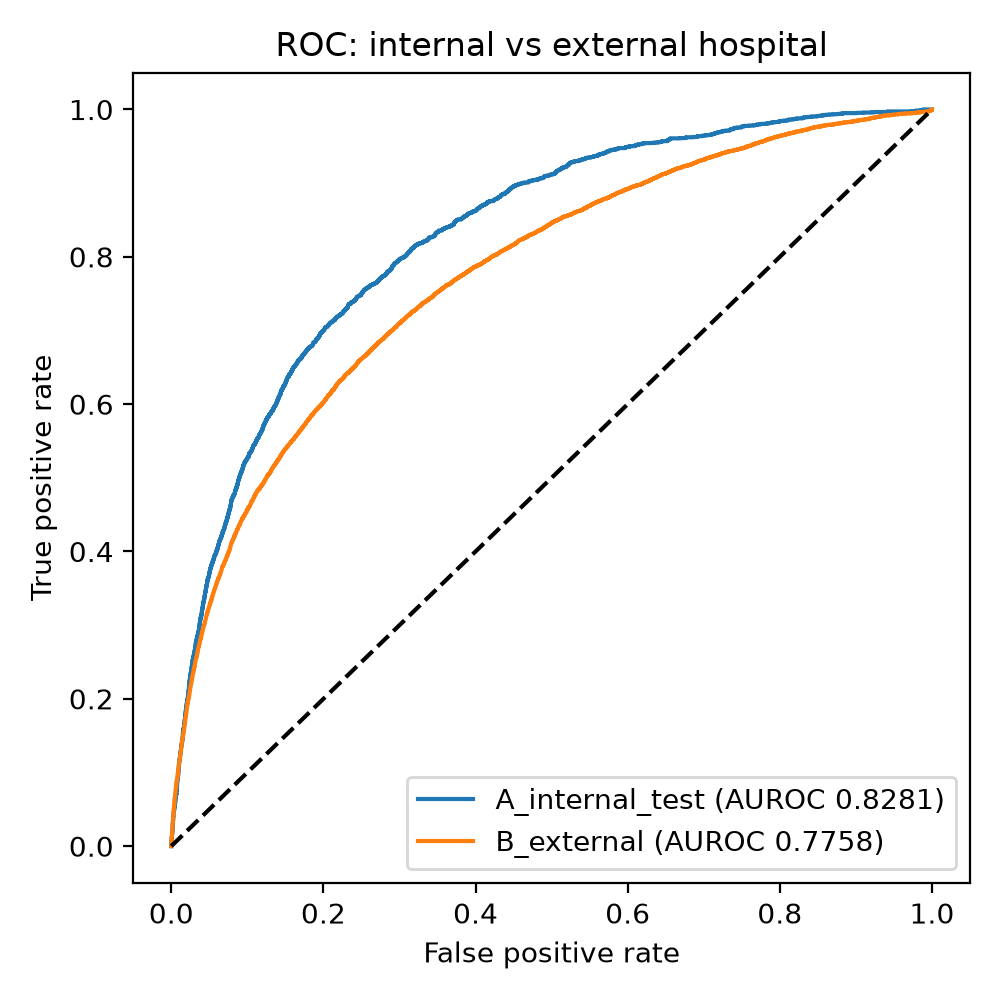
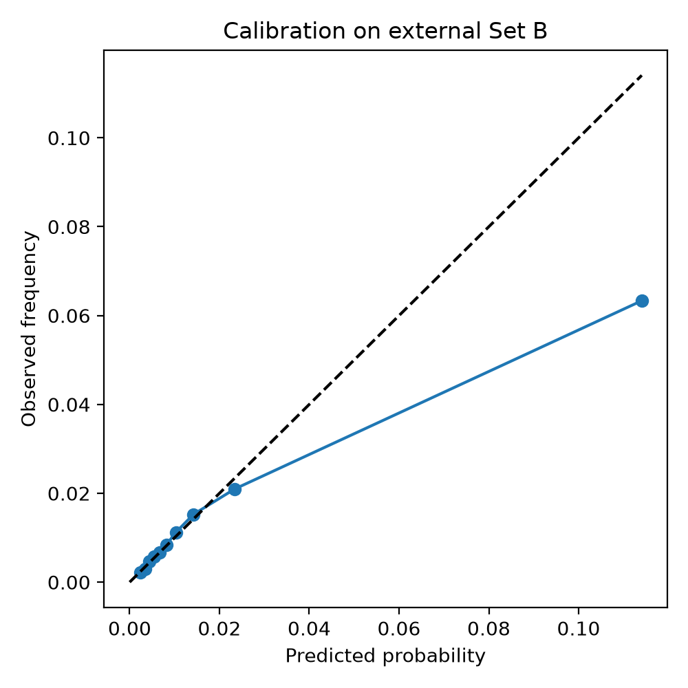
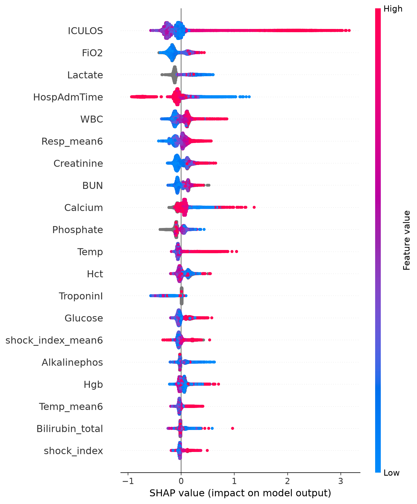

# Sepsis Early Warning: External Validation Across Hospital Systems

**Live Demo:** [Streamlit App](https://sepsis-early-warning-external-validation.streamlit.app/) | **DOI:** [](https://doi.org/10.5281/zenodo.23019969) | **Preprint:** *In Progress*


> Research prototype. Not a medical device. Not for clinical use.

## Summary
Sepsis kills more patients when it is recognised late. This project develops a
physiology-informed machine-learning model that flags ICU patients up to 6 hours before
clinical sepsis onset, and tests whether it still works in a different hospital system.
The model was developed on one hospital system (Set A) and evaluated once, without
retuning, on another (Set B). Performance, calibration, subgroup behaviour and the
physiological plausibility of its predictions are all reported.

Author: Ajibola Odeyemi, BSc Physiology, Specialist in Quantitative & Qualitative Analytics. Physiology training guided the feature
design and the interpretation of the model's predictions.

## Research question
Can routinely collected ICU vital signs and laboratory values, engineered using
physiological reasoning, predict sepsis several hours before onset, and do the results
hold across hospital systems?

## Data
PhysioNet/Computing in Cardiology Challenge 2019, "Early Prediction of Sepsis From
Clinical Data" (Reyna et al., Crit Care Med 2020), accessed via a Kaggle mirror.
- Set A: 20,336 patients (development). Set B: 20,000 patients from a different hospital
  system (external validation only).
- 40 hourly variables (vitals, labs, demographics) plus `SepsisLabel`.
- Licence: CC BY-NC-SA 4.0. Data are not redistributed here; see `data/README.md`.

## Methods
| Step | Detail |
|---|---|
| Split | Set A split by patient (70/15/15 train/validation/internal test); never by row |
| Features | Forward-filled values, "measured" indicators, shock index, pulse pressure, 6-hour rolling mean/SD/change of key vitals, SOFA-inspired organ flags |
| Leakage control | Features use only data up to the current hour; verified by unit test |
| Model | LightGBM with early stopping on the validation set |
| Threshold | Chosen on validation data only (maximum F1) |
| External test | Set B evaluated once, no retuning |
| Uncertainty | Patient-level bootstrap 95% confidence intervals |
| Extra analyses | Calibration, subgroup (sex, age), SHAP interpretation |

## Results
| Metric | Set A internal test | Set B external |
|---|---|---|
| AUROC (95% CI) | 0.828 (0.806-0.851) | 0.776 (0.762-0.789) |
| AUPRC (95% CI) | 0.119 (0.102-0.144) | 0.071 (0.064-0.079) |
| Shock index alone, AUROC | 0.592 | 0.607 |
| Brier score | 0.0207 | 0.0142 |

At the validation-chosen threshold on Set B, 42.8% of sepsis patients (n=1,142) triggered an alert before onset, and 6.8% of non-sepsis patients triggered at least one alert.

Subgroup AUROC on Set B (sex and age bands): see `reports/figures/subgroups.png`.





## Physiological interpretation
The single strongest driver of predicted risk is `ICULOS` (hours since ICU admission),
which likely reflects both accumulating physiological deterioration and the fact that
longer ICU stays carry a higher prior probability of eventual sepsis onset under this
dataset's labelling scheme. This is flagged as a limitation below, since it means part
of the model's signal may come from time-in-ICU rather than physiology alone.

Beyond ICULOS, the next largest contributors are physiologically coherent: elevated
`FiO2` (rising oxygen requirement, indicating respiratory compromise), `HospAdmTime`,
`WBC` (leukocytosis, a marker of systemic inflammatory response), `Resp_mean6`
(sustained tachypnea), and renal markers `Creatinine` and `BUN` (acute kidney injury
secondary to hypoperfusion). `shock_index` (heart rate / systolic BP) shows a
non-linear jump in predicted risk above roughly 0.9-1.0, consistent with the
transition from compensated to decompensating circulatory status. `Lactate`,
despite its central role in sepsis physiology, contributes comparatively little to
this model's predictions (see `shap_summary.png`) — most values cluster near zero
impact, likely because lactate is missing for a large share of hourly records and
the model instead leans on more frequently measured markers.

## Limitations
- Retrospective data from two US hospital systems; not validated in African settings.
- Labels follow a Sepsis-3-derived definition with a 6-hour pre-onset window.
- Measurement patterns reflect clinician behaviour and may not transfer between sites.
- Metrics are row-level. The official Challenge utility score is not reported.
- Not validated on MIMIC-IV or eICU, and not tested prospectively.
- Calibration on Set B shows over-prediction at high predicted risk; recalibration would be needed before any use in a new setting.
- `ICULOS` is the dominant feature in SHAP analysis, which may partly reflect the
  dataset's labelling scheme (longer stays carry a higher prior of eventual sepsis)
  rather than physiology alone. This is a known caveat in ICU deterioration modelling
  and should be investigated further (e.g. by testing the model's performance within
  narrow ICULOS bands).

## Repository structure
```text
sepsis-early-warning/
├── app/app.py            Streamlit demo
├── data/README.md        Data download instructions (data not included)
├── models/               Trained model and metadata
├── reports/              metrics.json and figures
├── src/                  data, features, train, evaluate, explain
├── tests/                Unit tests (feature correctness, no future leakage)
├── CITATION.cff
├── requirements.txt
└── README.md
```

## Reproduce
```powershell
python -m venv .venv
.venv\Scripts\Activate.ps1
pip install -r requirements.txt
# Place training_setA and training_setB in data/raw/ (see data/README.md)
pytest
python -m src.train
python -m src.evaluate
python -m src.explain
streamlit run app/app.py
```

## Future work
Sequence models (GRU/LSTM), validation on MIMIC-IV/eICU, and validation on African
ICU cohorts.

## Citation and licence
If you use this work, please cite both the original dataset and this repository.

**Dataset:** Reyna MA, Josef CS, Seyedi S, et al. "Early Prediction of Sepsis From
Clinical Data: The PhysioNet/Computing in Cardiology Challenge 2019." *Critical Care
Medicine*, 2020;48(2):210-217.

**This repository:** see `CITATION.cff`, or cite via the DOI above.

Code is released under the MIT License. The underlying dataset remains under its
original CC BY-NC-SA 4.0 licence and is not redistributed here.